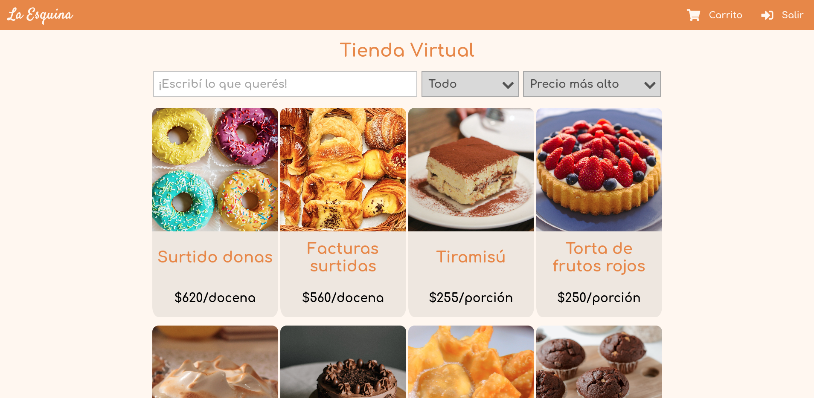

### *Proyecto de tienda virtual de una panadería de barrio hecha con el stack MERN*

### **Versión en línea: https://panaderia-la-esquina.herokuapp.com/**

   
 

### [English README here :uk: :us:](README-EN.md)

 

La tienda virtual es una aplicación de página única (SPA) de dos partes: el **frontend**, usando React; y el **backend**, que usa Node.js + Express.js y se conecta a una base de datos de MongoDB.

Algunas de las funcionalidades incluyen: catálogo de productos con filtros de búsqueda, administración de cuentas,  carritos de compra e integración con PayPal para pagos.

 

# Instalación y Uso Local
Para poder configurar el entorno de desarrollo de la aplicación localmente, seguir estos pasos:

1. **Clonar el repositorio y moverse a la carpeta de destino**
	
		$ git clone https://github.com/AugustoNicola/Panaderia-La-Esquina
		$ cd Panaderia-La-Esquina/
	
2. **Instalar las dependencias necesarias**
		
		$ npm run install-all-dependencies

3. **Conectar con los servicios necesarios**  
	Crear un archivo `.env` en el directorio base del proyecto. Este archivo se encarga de suministrar la información sensible necesaria. Dentro del archivo, agregar los campos:
	
		MONGODB_URL=tu_url_de_mongo
		SECRETO_TOKEN_ACCESO=tu_secreto_acceso
		SECRETO_TOKEN_REACCESO=tu_secreto_reacceso
	El `MONGODB_URL` conecta con tu propia BBDD, mientras que los `SECRETO`s se usan para verificar la veracidad de las sesiones de usuario, por lo que pueden ser cualquier contraseña (se recomienda un hash SHA256).

¡Listo, el proyecto debería estar configurado correctamente!

 

## Comandos

* `npm run client`: Inicia la aplicación React en `localhost:3000`
* `npm run node-server`: Inicia el servidor de backend en `localhost:5000`
* `npm run server`: Inicia el servidor de backend en `localhost:5000`, pero usando nodemon
* `npm run dev`: Inicia tanto el cliente como el servidor
* `npm run server-install-dependencies`: Instala las dependencias del backend
* `npm run client-install-dependencies`: Instala las dependencias del cliente
* `npm run install-all-dependencies`: Instala todas las dependencias

 

# Contribuciones y Licencia
Este proyecto está bajo la [Licencia MIT](https://choosealicense.com/licenses/mit/). **¡Podés leer, usar o modificar el código que necesites!**

Cualquier aporte de código, notificación de errores o fallas, sugerencias o cualquier otro tipo de contribución será enormemente agradecida. 

¡Espero que te haya gustado mi trabajo! :+1: